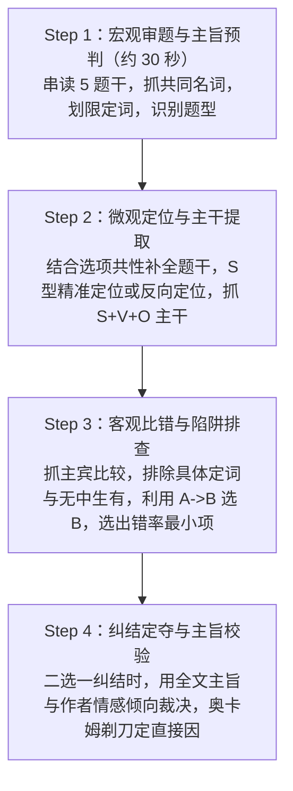

# 颉斌斌考研英语阅读方法论：考场实战解题 SOP 与全题型操作手册

> 本手册依据 7 张手写精读方法论笔记全面还原、提炼与重构，专为考研英语考场做题落地而设计。
> 摒弃模棱两可的感觉流做题，建立以**逻辑、结构、主干、选项固有缺陷、客观比错**为核心的标准化解题流水线。

---

## 目录
1. [第一部分：手写笔记 7 页逐张精细整理与核心要点还原](#第一部分手写笔记-7-页逐张精细整理与核心要点还原)
   - [第 1 张：精准定位、题干限定词与选项比错三步法](#第-1-张精准定位题干限定词与选项比错三步法)
   - [第 2 张：定位盲区破解、串读5题抓主旨与选项固有缺陷](#第-2-张定位盲区破解串读5题抓主旨与选项固有缺陷)
   - [第 3 张：主旨串读法、主旨9大来源与例证题核心法则](#第-3-张主旨串读法主旨9大来源与例证题核心法则)
   - [第 4 张：例证题反套路、推断题三大分类与态度论证方式](#第-4-张例证题反套路推断题三大分类与态度论证方式)
   - [第 5 张：态度题解法与必错词库、词汇题与句子题解法](#第-5-张态度题解法与必错词库词汇题与句子题解法)
   - [第 6 张：审题思维体系与四步做题闭环 SOP](#第-6-张审题思维体系与四步做题闭环-sop)
   - [第 7 张：考场实战 15 条绝杀铁律综合整理](#第-7-张考场实战-15-条绝杀铁律综合整理)
2. [第二部分：考场宏观流程——标准化做题 SOP（四步闭环）](#第二部分考场宏观流程标准化做题-sop四步闭环)
3. [第三部分：六大核心题型落地执行操作指南](#第三部分六大核心题型落地执行操作指南)
   - [题型一：事实细节题（含普通细节与不定冠词并列题）](#题型一事实细节题含普通细节与不定冠词并列题)
   - [题型二：例证题（开篇例、段中例、整段例与伪例证）](#题型二例证题开篇例段中例整段例与伪例证)
   - [题型三：因果推理题（奥卡姆剃刀、逻辑链与显隐性因果）](#题型三因果推理题奥卡姆剃刀逻辑链与显隐性因果)
   - [题型四：推断题（推细节、推段落、推全文与情态动词概率）](#题型四推断题推细节推段落推全文与情态动词概率)
   - [题型五：态度题（作者态度、人物态度与必错秒杀词库）](#题型五态度题作者态度人物态度与必错秒杀词库)
   - [题型六：词汇句意题（空白代入法、比较级逻辑与推导）](#题型六词汇句意题空白代入法比较级逻辑与推导)
4. [第四部分：纠结二选一与防暗算终极定夺绝招](#第四部分纠结二选一与防暗算终极定夺绝招)
5. [第五部分：考场临场 30 秒快速自检清单（Checklist）](#第五部分考场临场-30-秒快速自检清单checklist)

---

# 第一部分：手写笔记 7 页逐张精细整理与核心要点还原

---

### 第 1 张：精准定位、题干限定词与选项比错三步法
*(对应图片：微信图片_20260928000117_221_193.jpg)*

#### 一、精准定位
1. **理解题干**：
   - **题干完整**：直接阅读题干，提取核心定位词。
   - **题干不完整（半句话/填空型题干）**：必须加上 4 个选项，拼接构成完整句意；同时观察 4 个选项用词的共性。
   - **核心警惕：题干中的限定词**：
     - 时间/频度限定词：`often`, `sometimes`, `recently`, `now`, `used to`。
     - 范围/程度限定词：`main`, `mainly`, `most`。
     - **特殊限定词情态动词（`may` / `probably` / `would`）**：
       - 若原文定位句**有**该情态动词，则其为**限定词**，严格核对范围；
       - 若原文定位句**无**该情态动词，则属于**推断题**逻辑，带情态动词的选项往往具有容错率。
2. **选项共性**：
   - **结构共性**：4 个选项语法结构往往高度一致（如全是介词短语、全是动名词短语、全是完整从句等）。
   - **语义共性**：
     - 内容重复词（确定讨论的主题词范围）。
     - 方向（语义态度倾向是正向褒义、负向贬义还是客观中立）。
3. **精准定位四步法**：
   - **第一步：分析题干，注意限定词**（划出核心主干与时间/程度/范围限定词）。
   - **第二步：对比选项，求同找出共性**（通过选项反复出现的词明确核心焦点）。
   - **第三步：对比题干结合选项，完善定位信息**（利用选项的共性词补充题干不完整的信息）。
   - **第四步：S型找关键词缩小范围，根据完整信息精准定位**（在文章中采用 S 型扫读快速锁定定位句）。

#### 二、选项比错
1. **做题前提**：客观接受文章信息，以**“验证为主”**（先入为主是大忌，必须拿原文事实去验选项）。
2. **信息来源层次**：
   - 显性信息来源：文章、题干、选项前言。**特别注意最后的显性条件（时态 / 语态）**。
   - 隐性信息来源：句间逻辑、指代关系、语气暗含。
3. **选项比错核心原则**：
   - **先证明选项错误，排除不沾边的；留下沾边的，再细致比对**。
4. **具体比错操作流程**：
   - ① **对选项进行求异，找出最明显的区别点**（抓主语、宾语等具体差异）。
   - ② **逐一比错与精准定位的句子**进行对照。
   - ③ **选出错概率最小者**（考研英语是选“最不容易出错”的选项，而非选“最合自己胃口”的选项）。
5. **核心注意事项**：
   - **内容不完全一致并不是错**：考研英语是“同义替换”和“抽象概括”，只要方向不反、主干不偏，换了词不是错。
   - **比错重点在主干**：抓主干（S + V + O）。
   - **比错“不在主干”的三种特殊句型**（重点移位）：
     1. `there be + 名词词组 + 同位语从句` $\to$ **重点在同位语从句**。
     2. 观点句（某人说：`sb. said that...`） $\to$ **重点在说话的内容**。
     3. `S + V + O, but + S + V + O` $\to$ **重点在转折连词 but 后的分句**。
   - **做题抓词顺序**：
     - **先抓主语（不容易被同义替换）和宾语（核心实词）**。
     - **“阻名同，内容做题法”**：对比选项间的具体名词差异，凡是与定位句具体事实明显不符的直接秒杀排除。
   - **同一律**：内容和方向都必须一致；正确答案必须与题干和选项核心诉求具备强相关性。
   - **奥卡姆剃刀原则**：原因题中，**永远选择最直接的原因**，绝不脑补选拐弯抹角的间接原因。

---

### 第 2 张：定位盲区破解、串读5题抓主旨与选项固有缺陷
*(对应图片：微信图片_20260928000126_222_193.jpg)*

#### 一、定位情况分类应对
1. **定位明显的题型**：
   - 精准定位的句子和题干高度一致。
   - 关键动作：**防干扰、防暗算**（谨防偷换修饰语、偷换偷加绝对词、反向偷换）。
2. **定位不明显的题型**：
   - 用**“意图选择伴判断”**。
   - **求同存异**：抓选项中的名词。
   - **内容做题法**：从选项语义反切文章。
   - **奥卡姆剃刀**做原因题。
3. **定位不到出题句的破解方案**：
   - 原因：① 问题太宽泛；② 找不到显性同义词。
   - **破法一：反向定位**——利用选项中最明显区别的点（求异点/独特的专有名词/长词）去原文反向检索，反向判断信息正误。
   - **破法二：取反 / 取非**：
     - **显性对立**：句中有转折词（`but`, `yet`, `however` 等）。
     - **隐性对立**：时间对比（`now` vs `used to`）、地点对比、比例对比。
   - **破法三：读歪主旨题**——凡是定位泛化的题，往往直接受制于全文或段落主旨，直接用主旨逻辑锁定答案。

#### 二、串读 5 道题干抓主旨（宏观开局法）
1. **读 5 题操作**：
   - **5 个题干 + 主旨题选项 $\to$ 求同，找重复词**。
   - 若只能得到**主旨词**，尚未明确方向：
     - 继续结合第 5 题主旨题的选项词汇做求同。
     - 题干提供的显性信息：若出现**两个主旨词**，题干之间的逻辑就是在表达**二者之间的关系**。
   - **题干之间的逻辑，很大程度上反映文章的行文结构逻辑**；考研命题原则是“出题顺序和原文行文顺序高度一致”。
2. **主旨题的两大核心内容**：
   - ① 文章主旨内容（核心论点、核心话题）。
   - ② 文章行文结构（现象-本质、问题-解决、观点-反驳）。

#### 三、选项的固有缺陷（考研命题规律与概率特征）
1. **选项的相关性（二选一定律）**：
   - 选项与选项之间，有时极其相似，有时截然相反。
   - 此时可以迅速缩小包围圈：**正确答案极大概率在这两项中产生（二选一）**！
   - **相似时**：若选项 A 与选项 B 存在逻辑推导/包含关系（若 $A \to B$），**则选 B**（选包容性更强、更本质、结论性的选项）。
   - **相反时**：两项互为矛盾反义，必有一真一假。
2. **无关选项的词汇容错率与出错概率分析**：
   | 选项用词特征 | 词汇属性与解释空间 | 容错率 | 在选项中的出错概率（设错率） |
   | :--- | :--- | :--- | :--- |
   | **虚空泛词**（相对化、抽象概括、缓和词） | 主观解释空间极大，内涵丰富 | **极高** | **最小（高频正确项特征）** |
   | **具体定词**（绝对化、狭隘细节、强限定词） | 指向极其明确，稍有不慎即错 | **极低** | **最大（50%以上为干扰项）** |
   | **弹性词 / 双见判断词**（主观视角词） | 介于两者之间 | **一般** | **中等** |
   - **核心认知**：内容具体程度具有相对性，越是抽象、宽泛、包容的选项，越容易是正确答案；越是把话说得绝、扣得细的选项，越容易是命题人设置的陷阱。

---

### 第 3 张：主旨串读法、主旨9大来源与例证题核心法则
*(对应图片：微信图片_20260928000135_223_193.jpg)*

#### 一、重复原理与不易出错法则
1. **重复原理**：
   - ① 结构重复。
   - ② 语义重复：内容 + 方向（用于分类归纳与反向定位）。
2. **不易出错规律**：
   - **词的角度**：三种词易正确——主旨词、虚空泛词、情感缓和词。
   - **句意角度**：以下三类句子天然不易出错：
     1. **大道理**（符合公序良俗、客观真理、辩证思维的话）。
     2. **约为主集**（包含其他子集的综合性表述）。
     3. **概括性强**的抽象总结句。

#### 二、主旨思维与文章串读规则
1. **读题干，抓主题词**。
2. **串读文章标准路线**：
   - **第一段**：读第一句 + 句间转折（转折后常为主旨）。
   - **第二段**：读第一句 + 紧挨第一句的转折句。
   - **中间各段**：同第二段处理方式（首句 + 紧邻转折）。
   - **最后一段**：同第一段处理方式（首句 + 尾句或转折，常为总结升华）。
   - **首句让位原则（以下三种情况，第一段第一句不是主旨，改读第二句）**：
     1. 第一句是**问句**（自问自答，答句是主旨）。
     2. 第二句是**转折句**（`But/However...` 否定首句）。
     3. 第一句只是**承上启下或引子背景**。
   - **串读时标出四大重点符号**：
     - 主旨词：画方框 $\square$
     - 逻辑词：画三角 $\triangle$
     - 否定词：画圆圈 $\bigcirc$
     - 代词：画波浪线 $\sim\sim$
   - **遇到纯细节段直接跳过不读**。
3. **主旨 9 大线索/来源**：
   1. 读 5 道题干抓共同主题词。
   2. 题干之间的行文逻辑。
   3. 选项之间的逻辑呼应。
   4. 前后题目的共性词。
   5. 研究或实验得出的**结论**（conclusion/finding）。
   6. 全文贯穿的**作者态度**。
   7. 各细节题**已做题目的定位句**串联。
   8. 例外题的**双关句/暗含句**。
   9. 文章或各段落的**最后一句话**。

#### 三、特殊细节题分类与例证题精解
- 特殊细节题包括：**例证题、推断题、态度题、词汇题、句子题**。
- **例证题（Exemplification Question）核心解法**：
  - **题干特征**：时态常为一般现在时；题干常问作者提及某个例子、故事、人物的**目的（purpose / in order to / to show）**。
  - **解题铁律**：**答案绝不选例子本身的内容！例子本身是论据，用来支持观点的！**
  - **两大常见位置解法**：
    - ① **开篇例（文章第一段第一句就是例子）**：
      - 看例子句后面的内容（往后读），寻找作者通过转折表达观点的句子。
      - 若后文找不到显性观点句，用主旨 9 种方法提取全文主旨（优先用紧邻观点句）。
    - ② **段中例（除各段第一句外，在任何地方出现的例子）**：
      - **看例子句的前一句或前半句**（观点在例子之前）。
      - 若前一句找不到观点，退而求其次看该段**段落首句（段落主旨句）**。

---

### 第 4 张：例证题反套路、推断题三大分类与态度论证方式
*(对应图片：微信图片_20260928000142_224_193.jpg)*

#### 一、例证题补充：整段例与反套路
1. **整段例（整整一段全是例子、故事、数据）**：
   - 解法：**看例子所在段的前一段段落主旨，或看全文主旨**。
2. **反套路情况（常规前看/后看找不到答案时）**：
   - ① 关注对于例子本身的**定义、本质、双观点句**（如出现 `“We find that...”` / 调查研究发现...）。
   - ② 关注例子内部包含的**多主体属性关系**。
   - ③ **警惕“伪例证真细节题”**：如果题干并不是问目的（不是 in order to/to show），而是问该例子里的具体事实细节，必须当成事实细节题去精准定位，不可生搬观点。

#### 二、推断题（Inference Question）
1. **题干特征词**：`infer`, `imply`, `learn`, `suggest`, `true`, `conclude`。
2. **选项核心概率规律**：
   - 带有情态动词 `may`, `might` 等缓和词的选项，往往代表“某种结论”，**正确概率极高**。
   - 考研推断是“微推”，情态动词带有某种合理推测含义，极具容错空间。
3. **隐性信息与思维方式**：
   - 隐含信息在文中反反复复出现。
   - **反向获取（取非逻辑）**：正话反说，对原文事实进行合理逆推。
   - 双见分析，穿过表象看本质；**直截了当正向获取信息多，取非难度大**。
4. **推断题三大分类与解法**：
   - ① **推细节**：题干关涉原文某一句话或某个具体对象 $\to$ 抓介词短语、找代词指代、内容细节抓主干。
   - ② **推段落**：题干关涉某一个整段（如 `It can be inferred from Paragraph X that...`） $\to$ 找段落主旨（**末句 / 句间跨度转折 > 首句**）。
   - ③ **推全文**：题干未指定段落（如 `Which of the following is true?`） $\to$ 答案往往直指**全文主旨**，直接用全文核心论点和主旨词去降维筛选。

#### 三、态度题特征与作者表达观点的五大方法
1. **态度题题干特征**：
   - ① `according to sb.`
   - ② `in one's opinion`
   - ③ `attitude`
   - ④ `v + that`（主观观点动词：`hold`, `argue`, `state`, `note`, `assume`, `maintain`, `suspect`, `contend`, `claim`, `feel`, `agree`, `believe`）
   - ⑤ `conclude`
2. **作者强调观点的五大论证方式**：
   - ① **因果论证**：借助明显的因果逻辑词推导出的结论。
   - ② **对比论证**：正反对比（`unlike`, `on the contrary`）与比较对比（比较级）。
   - ③ **事实例证**：引用常规权威机构/专家的话语。
   - ④ **强调论证**：情态动词、强调性副词/形容词、强调句型（`It is ... that...`）。
   - ⑤ **强认同论证**：**反问句**（反问句表面是疑问，实际表达强烈肯定的态度，无疑问）。

---

### 第 5 张：态度题解法与必错词库、词汇题与句子题解法
*(对应图片：微信图片_20260928000150_225_193.jpg)*

#### 一、态度分类与解题思路
1. **文内某人的态度（局部人物观点）**：
   - 标志：`sb. said...`, `sb. argues that...`, `consider/regard/view A as B`。
   - 解法：
     - 找到该人物说话或得出结论的精准定位句，拿选项客观比错。
     - 若选项包含细节，利用人称代词、动作主体排查，看主体是否偷换。
2. **作者的态度（全文主观倾向）**：
   - 解法：
     - 精准定位句 + 选项比错 + **防刺头（防反向干扰）** + **核对修饰程度**。
     - 若题干无明确定位点，**直接使用全文主旨法判定作者情感倾向**（褒、贬或客观中立）。
3. **态度词红宝库（必背与秒杀）**：
   - **高频正确态度词**：
     - `tolerant`（宽容的/包容的）
     - `critical`（批判的/审慎批评的）
     - `supportive`（支持的）
     - `skepticism` / `skeptical`（怀疑的/审慎质疑的）
     - `optimistic`（乐观的）
     - `ambiguous`（模棱两可的，需视特定语境而定）
   - **【秒杀】必错/偷懒排除词（直接排除，绝不可选）**：
     - ❌ `subjective`（主观的——考研学术文章要求客观严谨）
     - ❌ `biased` / `partial`（有偏见的/不公的）
     - ❌ `puzzled` / `confused`（困惑不解的——作者写文章是为了解惑，绝不会说自己很懵）
     - ❌ `indifference` / `indifferent`（漠不关心的——漠不关心就不会专门写一篇文章探讨）

#### 二、词汇题与句子题解题法则
1. **词汇题（Vocabulary Question）**：
   - **特殊技巧**：看同义词、意思相似的词；**词义必然与主旨方向高度相关**（考研词汇题从来不是考单纯背单词，而是考语境与主旨）。
   - **常规方法——空白代入法（XX替换法）**：
     - 将原词/生词直接用“XX”替代。
     - 依据上下文的前后逻辑线索（转折、并列、解释、因果），推理该空应当填入什么含义的词。
     - 确保所选词在**逻辑关系和语义方向上完全一致**。
2. **句子理解题（Sentence Comprehension）**：
   - ① **分析句子本身逻辑**（主干结构、内部的因果/转折分句）。
   - ② **分析句间逻辑**（该句与前句、后句是顺承、转折、例证还是因果关系）。
   - 选项缺陷利用：若出现 $A \to B$ 逻辑推导，**选 B**（选承接更深、结论性的内容）。
3. **主旨题的核心总结**：
   - 内容 + 结构双核驱动。
   - 串读 5 题干 + 结合选项逻辑相互验证。

---

### 第 6 张：审题思维体系与四步做题闭环 SOP
*(对应图片：微信图片_20260928000158_226_193.jpg)*

#### 一、宏观审题思维体系
1. **事实细节题的三大信息支柱**：
   - **原文信息**：精准定位句 vs 反向定位。
   - **题干信息**：
     - 显性信息：主旨词、核心名词。
     - 隐性信息：由词汇色彩、句式暗示的信息。
     - 题干逻辑：句式结构与问题所指向的真正标的。
   - **分类细化**：锁定题目的**目标（询问对象）、标的、限定词**。
   - **选项信息**：选项间的相关性（相反、相似、重复），**优先抓名词进行求同存异**。
2. **宏观与微观的关系**：
   - 发现微观细节难以判断时，**立刻跳出局部，用逻辑主旨进行裁决**。
3. **定位策略的灵活切换**：
   - 正向定位明确 $\to$ 正确定位；正向定位受阻 $\to$ 果断反向定位。

#### 二、考场做题四大步骤（闭环 SOP）
1. **第一步：读题 + 抓主旨**：
   - ① 读完 5 道题干求同或取反，提炼全文主旨预期。
   - ② 明确各题题型，从题干中抓取主旨词与限定条件。
2. **第二步：深度审题**：
   - ① 分析题干：圈定限定词、目标、出题意图。
   - ② 选项求同存异：观察结构共性、语义共性（内容与方向）；对比选项求异，求同存异标准：**名词 > 非名词**。
3. **第三步：五维灵活解题**：
   - ① **选项固有缺陷法**：利用相关性、重复性、不易出错点作为先验预判。
   - ② **问因溯果法**：遇到原因题，动用奥卡姆剃刀，选最直接因。
   - ③ **正向解题法**：精准定位 + 选项客观比错 + 防刺头干扰（主干内容做题法）。
   - ④ **反向解题法**：正向定位困难时，从选项差异特征回文反查，比对差错。
   - ⑤ **宏观解题法**：纠结不下时，用全文主旨自上而下反向定夺。
4. **第四步：结账分析与复盘**：
   - 做完后积极对题目的本质进行归纳，理解命题人意图与主旨的吻合度。
   - **以篇为单位**，从尽可能多的角度反思复盘，形成做题肌肉记忆。

---

### 第 7 张：考场实战 15 条绝杀铁律综合整理
*(对应图片：微信图片_20260928000206_227_193.jpg)*

1. **主旨挂钩铁律**：
   - **例证题、态度题、主旨题都必须高度和主旨相关**。对文章的选文和态度理解抽象概括起来与主旨相关，然后在选项中求同存异。
2. **例证题位置铁律**：
   - 整段是例子看前文，段中例看前文，开篇例看后文。
   - 关注标志词：`introduce`, `topic`。**直截了当，例子本身内容坚决不选！**
3. **细节题定位铁律**：
   - 抓“关键人物 + 关键词限定词”，**防刺头（防长从句/修饰语干扰陷阱）**；核心是填补题干留下的语义空缺。
4. **推断题主旨与概率铁律**：
   - 推断题和主旨密切相关，**特别是文章最后一道推断题，极大概率就是全文主旨题**！
   - 选项中出现 `may`, `might` 等推测动词，正确概率极高。
   - 整段推断题：**最后一句话 / 中间大跨度转折句 > 首句**。
5. **态度题综合铁律**：
   - 依据全文态度，根据词面褒贬及定位句做题。
   - 排除刺头干扰，重点看段落尾句、跨度转折或首句。
6. **不定冠词多重并列铁律**：
   - **若题干所问对象的名词前带有不定冠词 `a` / `an`（如 a factor, a reason, an example），原文定位句往往伴随“多重并列结构”**（如 first, second, also, or, as well as）。
7. **推断题双轨解法**：
   - 常规情形下，精准正向定位与反向取非皆可使用。
8. **原因题奥卡姆剃刀与逻辑链铁律**：
   - 必须遵循**奥卡姆剃刀原则**：若选项呈现因果推导链 $A \to B$（因为 A 所以 B），**题目问直接原因时，必须选链条中最直接、最靠近结果的一环**。
   - **同一律**：主体对象必须严格一致，不得偷换主体。
9. **伪例题反向定位铁律**：
   - 例子出现在末尾若是借题发挥引出结论，观点往往在后文反向定位，**优先利用选项名词求同存异**。
10. **原因连词熟词僻义**：
    - `in that` 意为**“因为”（because）**，在选项或原文中出现属于高频考点。
11. **细节题正难则反铁律**：
    - 当细节题正向精准定位极其困难时，果断改为**“利用选项差异点反向定位”**。
12. **复杂原因题与因果词链条**：
    - 抓复合逻辑与同义替换，特别注意**指代词回溯**。
    - **显性因果词**：`as a result`, `consequently`, `because`, `due to`。
    - **隐性因果词**：`the implication`, `effect`, `lead to`, `reflect`, `derive from`。
13. **专家权威与主旨同向铁律**：
    - 题干考查专业人员、研究机构、学者的研究结论，**必然与文章核心主旨同向**（借权威之口言作者之志）。
14. **主旨词反复重现铁律**：
    - 题干中反复出现、选项中反复出现的词汇，**必定是全文主旨核心词**；哪怕选项看起来像细节，只要抓住了核心主旨词且方向一致即可选。
15. **句子理解与比较级铁律**：
    - **比较级的前面重于比较级的后面**（如 $A > B$，核心论点在强调 $A$）。
    - 比较级必须严格核对：**对比对象、比较维度、比较结果**，防止颠倒。
    - 选项存在 $A \to B$ 关系时，选 $B$。

---

# 第二部分：考场宏观流程——标准化做题 SOP（四步闭环）

在考场上，拿到一篇阅读理解，严禁直接扎进第一段读全文，必须严格执行以下**四步标准化作业流水线**：

### Step 1：宏观审题与主旨预判（30~45 秒）
1. **不看正文，先扫 5 个题干**：
   - 圈出所有题干中**反复出现的名词/大写词** $\to$ 这就是本文的**主旨核心词**。
   - 观察题干逻辑走向：题干往往反映行文顺序（现象 $\to$ 争议 $\to$ 实验 $\to$ 结论）。
2. **标定题型与限定词**：
   - 标注每道题的题型代码：[细节]、[例证]、[原因]、[推断]、[态度]、[主旨]。
   - 圈出题干中的**时间/范围限定词**（`often`, `now`, `recently`, `used to`, `most`, `main`）。

### Step 2：微观精准定位与主干提取
1. **题干完整性检查**：
   - 完整题干：直接提炼 1~2 个最不易替换的核心名词。
   - 不完整题干（填空题）：快速扫一眼 4 个选项，找到**选项的结构与语义共性**，带入题干合成完整句后再定位。
2. **定位执行**：
   - **正向 S 型定位**：顺着出题顺序，在对应段落用 S 型找关键词，锁死定位句。
   - **定位句主干提取**：
     - 抓**主语（最稳） + 谓语动词 + 宾语**。
     - **三种移位句型看核心**：
       - `there be + 名词 + 同位语从句` $\to$ 看同位语从句。
       - `sb. said that...` $\to$ 看宾语从句内容。
       - `分句1, but + 分句2` $\to$ 核心在 but 之后！

### Step 3：选项客观比错（先证明错误，再择优）
1. **求异对比**：
   - 快速横向扫视 4 个选项，挑出它们之间**最明显的差异点**（重点看主语和宾语名词）。
2. **逐一验证比错（客观排除法）**：
   - 排除**偷换主体**（同一律不符）。
   - 排除**正反颠倒 / 比较级反转**。
   - 排除**无中生有 / 具体定词绝对化**。
   - 记住：**不是选最完美的，而是选出错概率最小的！内容不完全一致是正常同义替换！**

### Step 4：纠结定夺与主旨回归
1. 当剩下两项难以抉择时，启动**“选项固有缺陷”法则**：
   - 若两项一虚一实：**选虚空泛词（概括性、容错率高），弃具体定词**。
   - 若两项 $A \to B$：**选更深、更本质、代表结论的 B**。
   - 若是原因题：**启动奥卡姆剃刀，选距离结果最直接的原因**。
2. **终极校验**：将所选选项与文章主旨和作者感情色彩对齐，方向一致者必对。

---

# 第三部分：六大核心题型落地执行操作指南

---

### 题型一：事实细节题（含普通细节与不定冠词并列题）

#### 1. 题型识别
- 题干包含具体人名、地名、概念、事件，以 `According to the text / the author...`, `...because...`, `What does...` 提问。

#### 2. 定位规则
- **正向精准定位**：题干核心名词定位。优先找专有名词、长难词、数字，其次找主谓宾。
- **正难则反（反向定位）**：若题干非常宽泛（如只问 `The author suggests that...`），直接用选项中的独特名词回原文反查。
- **特殊信号：不定冠词 `a` / `an` 铁律**：
  - 题干若问 `a factor / a reason / a consequence` 等带 `a/an` 的泛指名词，**定位句或其前后句必定存在多重并列**（如：`first... second...`, `also`, `as well as`, `not only... but also`）。必须回原文找到并列项，看选项落在哪一个并列分支上！

#### 3. 落地解题公式
$$\text{正确项} = \text{定位句主干（主谓宾）的同义替换}$$
- **抓主干**：先抓主语（最难替换），再抓宾语核心名词。
- **比错防刺头**：警惕定语从句、状语从句中的偷换修饰，不要被冗长的插入语带偏。

#### 4. 干扰项秒杀特征
- ❌ **具体定词过度化**：包含 `must`, `always`, `never`, `only`, `all` 等绝对词（出错率最大）。
- ❌ **张冠李戴/偷换主体**：把其他段落或原文别人的属性安在题干主体上。
- ❌ **答非所问**：选项本身说得对（原文有），但根本不是题干所问的内容。

---

### 题型二：例证题（开篇例、段中例、整段例与伪例证）

#### 1. 题型识别
- 题干出现：`is mentioned to / is cited to show...`, `in order to...`, `The example of... illustrates that...`, `The author uses the story of... to...`。

#### 2. 核心绝对铁律
> ⚠️ **死律：例子本身的内容绝对不选！选项如果直接复述例子的细节/人名/数字，100% 是干扰项！**

#### 3. 落地定位与解法公式
- **情况 A：开篇例（第 1 段第 1 句就是例子/故事）**
  - **公式**：**向后看**。寻找例子结束后的**转折词**（`But`, `Yet`, `However`）或作者总结句，该句即为论点。找不到则看全文主旨。
- **情况 B：段中例（除第 1 句外的段落内部例子）**
  - **公式**：**向前看**。重点精读**例子句的前一句或前半句**；若前一句是次级论点看不懂，跳到该段**首句（段落主旨句）**。
- **情况 C：整段例（整整一段全在讲故事、列数据）**
  - **公式**：**看前一段末尾/主旨**，或看**后一段开头**，观点在例子所依附的上下文中。
- **情况 D：伪例证真细节题（反套路）**
  - 若题干问的是 `What happened to X?` 或 `The author found that in X...`，没有 `in order to / to show`，此时是**假例证、真细节**，必须老老实实回例子内部定位事实！

---

### 题型三：因果推理题（奥卡姆剃刀、逻辑链与显隐性因果）

#### 1. 题型识别
- 题干包含：`because`, `due to`, `result from`, `the reason for...`, `...in that...`。

#### 2. 因果词汇高频储备
- **显性因果词**：
  - 原因：`because`, `since`, `as`, `for`, `in that`（高频生僻考点！）, `owing to`, `attribute to`
  - 结果：`therefore`, `thus`, `consequently`, `as a result`, `so`
- **隐性因果词**：
  - `lead to`, `cause`, `bring about`, `derive from`, `result in`
  - `the implication`（暗含因果）, `the effect / consequence`, `reflect`（反映=结果反映原因）

#### 3. 落地做题三大法则
- **法则 1：奥卡姆剃刀原则（选最直接原因）**：
  - 考研因果题极其忌讳多步主观脑补。
  - 原文可能呈现因果链条：$A \to B \to C \to D$。
  - 若题目问 $D$ 的原因，**必选最紧邻的直接前因 $C$**，不要越级选 $A$。
- **法则 2：逻辑推导与包含关系**：
  - 若选项 A 与选项 B 呈因果或推导逻辑（$A \to B$），**结论项选 B**。
- **法则 3：同一律校验**：
  - 原因与结果的**主体、动作承受者**必须高度一致，谨防选项因果倒置（把原因说成结果）或偷换主体。

---

### 题型四：推断题（推细节、推段落、推全文与情态动词概率）

#### 1. 题型识别
- 题干包含：`infer`, `imply`, `learn from`, `suggest`, `conclude`, `It can be learned that...`。

#### 2. 解题落地分类
- **类型 1：细节推断题（题干带具体名词/行号）**
  - 当成细节题做！回原文定位句，寻找**轻度同义替换**或**正反反向取非**。
- **类型 2：段落推断题（题干指定 Paragraph X）**
  - 推断段落往往等同于考查段落核心！
  - **看句优先级**：**段落末句 $\ge$ 句间大跨度转折句 $>$ 段落首句**。
- **类型 3：全文推断题（题干未指定段落，如 `Which of the following is true?`）**
  - **特别是整篇文章的第 5 题推断题，100% 紧扣全文主旨！**
  - 直接提取全文主旨词和作者态度，优先用主旨去匹配选项。

#### 3. 选项概率与特征法宝
- **情态动词概率定律**：
  - 选项中带有 `may`, `might`, `can`, `could`, `not necessarily`, `be likely to` 等缓和情态动词的，**具有极高的正确概率（容错率极高）**。
- **取非微推**：
  - 原文：“过去大家都认为 A 是对的（`used to think A`）” $\to$ 推断：“现在作者认为 A 不对 / 存在缺陷”。
  - 隐性对比时间点（`now` vs `past`）、地点、比例。

---

### 题型五：态度题（作者态度、人物态度与必错秒杀词库）

#### 1. 题型识别
- 题干包含：`attitude`, `tone`, `view`, `deem`, `consider`, `in one's opinion`。

#### 2. 分类处理：作者态度 vs 文中人物态度
- **作者态度**：
  - 必须看全文基调。关注作者使用的形容词、副词情感色彩（褒贬度）。
  - 若有权威机构、专业人士（Scientists, Researchers）的研究结论，**权威观点 = 作者观点**（借刀杀人）。
- **文中人物态度**：
  - 严格精准定位到该人物说话的句子（`sb. said / argued / noted that...`），只看该人物在引号内或宾语从句中的表态，绝不能将其他人的态度强加给他。

#### 3. 态度词秒杀红黑榜
| 类别 | 词汇列表 | 考场应对策略 |
| :--- | :--- | :--- |
| **必错/偷懒秒杀词**（黑名单） | `subjective`（主观的）、`biased` / `partial`（有偏见的）、`puzzled` / `confused`（困惑的）、`indifferent` / `indifference`（漠不关心的）、`unconcerned`（不关心的） | **考场见之直接划掉！绝不可能是正确选项！** |
| **高频正确词**（红名单） | `tolerant`（宽容的）、`critical`（批判的/审慎的）、`supportive`（支持的）、`skeptical` / `skepticism`（怀疑的）、`optimistic`（乐观的）、`objective`（客观的）、`reserved`（有保留的） | **高频正确项，重点比对与文章倾向的一致性** |
| **极端词警惕** | `enthusiastic`（狂热狂喜的）、`hopeless`（完全绝望的） | 学术论文极少走极端，除非原文言辞极度激烈，否则慎选 |

---

### 题型六：词汇句意题（空白代入法、比较级逻辑与推导）

#### 1. 题型识别
- 题干给出一个单词、短语或长难句，加双引号，问 `most probably means...` 或 `indicates that...`。

#### 2. 词汇题实战技巧
- **思想准备**：所考词汇 80% 是考**熟词僻义**或**生词语境推断**，绝不能光凭字典原意生搬硬套。
- **落地方法一：空白代入法（XX 法）**：
  1. 把目标词/短语挖空，用“XX”替代。
  2. 审视该句与前后句的**逻辑关系词**：
     - 若前后是并列/顺承/解释（`and`, `;`, `:`, `that is`），则 XX 的语义和方向与前后一致。
     - 若前后是转折/对立（`but`, `however`, `instead of`, `while`），则 XX 的语义和方向与相反项取非。
  3. 将 4 个选项代入，看哪个选项填进去逻辑最通顺。
- **落地方法二：主旨统领法**：
  - 词汇题的答案词，其感情色彩和内涵必然与**全文或段落主旨同向**。

#### 3. 句子理解题与比较级考点
- **句子本身逻辑 + 句间逻辑**：
  - 划分长难句主谓宾，抓句子核心意图。
- **比较级绝杀铁律**：
  - **比较级前面重于比较级后面**：例如 $A$ is more vital than $B$，重心在强调 $A$ 的重要，而非强调 $B$。
  - **三要素核对**：必须精确核对**对比主体是谁、比什么维度、谁胜谁负**。干扰项最喜欢正反倒置！
  - **推导包含**：若选项间出现 $A \to B$，**选 B**。

---

# 第四部分：纠结二选一与防暗算终极定夺绝招

在考场上，考生丢分最多的往往是排除了两项，在剩下的两个选项中“完美避开正确答案”。此时，切禁凭借个人经验反复胡思乱想，立刻启动以下**四大终极定夺法则**：

### 法则一：虚空泛词 vs 具体定词（容错率定律）
- **虚空泛词**：用词宽泛、抽象、概括、有余地（如 `may`, `help`, `tend to`, `not all`, `influence`, `matter`）。
  - **考场结论**：主观解释空间大，**容错率极高，出错概率最小 $\to$ 极大概率是正确项**！
- **具体定词**：用词明确、狭隘、绝对、填满细节（如 `all`, `every`, `exact`, `completely`, `only` 或死抠生僻细节）。
  - **考场结论**：指向过于明确，50%以上错得深，**出错概率最大 $\to$ 大概率是设错陷阱**！

### 法则二：逻辑包含与推导（$A \to B$ 选 $B$）
- 当剩下的两项都觉得有道理，但仔细推敲发现：**如果 A 成立，必然能推导出 B 成立（A 是前提/具体手段，B 是更宏观的目的/深层结论）**。
- **考场结论**：**直接选 B！** 选包容度更大、更具概括性的一项。

### 法则三：奥卡姆剃刀与同一律（原因题直接因）
- 两个选项都在讲原因，一个讲得深远复杂，一个讲得直接直白。
- **考场结论**：直接选**最直接、最紧扣题干定位句主体**的那一项！如无必要，勿增实体。

### 法则四：主旨与情感色彩终极降维打击
- 当微观细节彻底无法分辨时，立刻将两个选项拉到**全文主旨高度**：
  1. 哪个选项包含了**全文主旨核心词**？
  2. 哪个选项的态度倾向（褒贬色彩）与**作者全文的情感倾向高度一致**？
  - **方向一致者胜出，背离主旨者秒杀！**

---

# 第五部分：考场临场 30 秒快速自检清单（Checklist）

| 序号 | 自查维度 | 核心核对问题（做完每道题在心里打钩） |
| :---: | :--- | :--- |
| **1** | **限定词核对** | 我看清题干里的 `often`, `recently`, `now`, `used to`, `mainly` 了吗？有没有时间错位？ |
| **2** | **主干一致性** | 选项的主语和宾语与原文定位句一致吗？有没有偷换动作发出者或承受者？ |
| **3** | **例证纯洁性** | 这是一道例证题吗？如果是我有没有误选了**例子本身**？（选了立刻改！） |
| **4** | **态度黑名单** | 态度题选项里有没有 `subjective` / `biased` / `puzzled` / `indifferent`？有则直接排除！ |
| **5** | **原因直接性** | 原因题我有没有想太多？我选的是不是定位句最直接的原因（奥卡姆剃刀）？ |
| **6** | **情态与容错** | 纠结选项里有没有带 `may` / `might` / `likely` 的虚词？它是不是更稳健？ |
| **7** | **主旨同向性** | 这个选项符合全文主旨吗？跟作者的褒贬立场有没有冲突？ |
